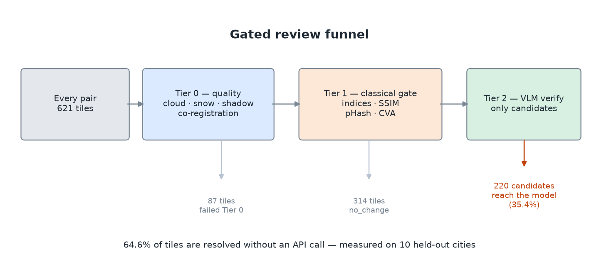
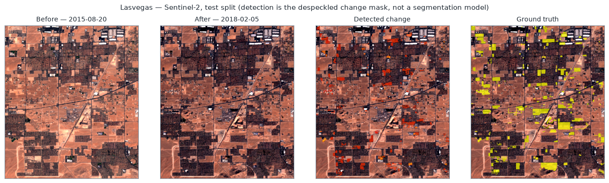
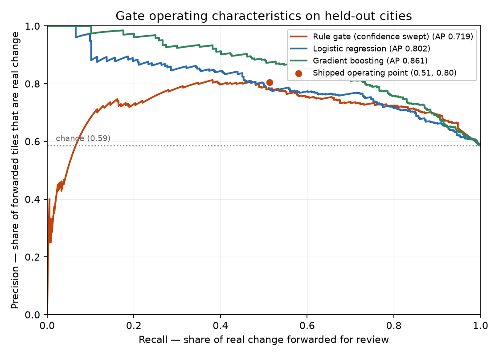

# SatChangeGate

A cost-controlled review funnel for satellite change detection: cheap deterministic
preprocessing and a classical gate filter the stream, and expensive vision-model
review runs only on what survives.

[](https://github.com/darthmanwe/SatChangeGate/actions/workflows/ci.yml)
[](LICENSE)
[](pyproject.toml)



## Quickstart

No dataset download and no API key required:

```bash
make setup
make demo
```

That runs the full funnel on committed synthetic fixtures. For the real
benchmark (~513 MB, checksum-verified, no registration required):

```bash
make data     # download 13-band Sentinel-2 OSCD
make eval     # out-of-sample evaluation on held-out cities
```

Or with Docker, which avoids the GDAL/OpenCV install entirely:

```bash
docker build -t satchangegate . && docker run --rm satchangegate --help
```

## Results

Measured on the **10 held-out OSCD cities**, which are never seen during
threshold tuning. Disjointness between the tuning and evaluation splits is
asserted at runtime, not assumed.

| Metric | Value | 95% CI |
|---|---|---|
| Precision | **0.804** | 0.747 – 0.852 |
| Recall | 0.513 | 0.460 – 0.565 |
| Specificity | 0.772 | 0.708 – 0.827 |
| F1 | 0.626 | — |
| Balanced accuracy | 0.643 | — |

n = 534 scored tiles (345 change / 189 no-change) from 621 total; 87 were
rejected by Tier 0 quality checks and are reported separately rather than
counted as negatives. Confusion matrix: TP 177 · FP 43 · FN 168 · TN 146.

**The operating point is high precision, moderate recall.** The gate filters
**64.6%** of tiles before any API call, and when it does flag something it is
right about 80% of the time. It also misses about half of all change. For a
spend-control layer in front of human or model review that is usually the right
trade — but it is a trade, and it should be stated as one rather than buried.



Las Vegas, a held-out test city. The detection panel is the despeckled change
mask; comparing it against ground truth shows the shape of the trade — the
flagged regions are largely real, and a good deal of real change is not flagged.

Reproduce: `make data && make tune && make eval`. Sample outputs are committed
under [`public_reporting_sample/`](public_reporting_sample/).

### Is a hand-written gate the right choice?

The gate is three rules over eleven numeric features. The obvious question is
why those features are not simply handed to a classifier, so the repo answers it
rather than leaving it open — same features, same split, same leakage assertion:

| Model | Average precision | ROC AUC | Precision @ the gate's recall |
|---|---|---|---|
| Rule gate (confidence swept) | 0.719 | 0.728 | 0.784 |
| Logistic regression | 0.802 | 0.747 | 0.787 |
| **Gradient boosting** | **0.861** | **0.805** | **0.877** |

**Gradient boosting wins, clearly** — +0.14 average precision over the rules, and
+7 points of precision at the same recall. That is the honest result, and it is
reported rather than buried.

The rules remain the default anyway, for reasons worth stating plainly: they are
inspectable (every decision returns the rule that fired), they add no runtime
dependency, and there is no model artifact to version, retrain, or drift. For a
spend-control filter those properties are worth real money. The measured price of
that choice is the 0.14 AP above — run `satchangegate baselines` to reproduce it,
and swap in the learned scorer if your deployment values accuracy over
inspectability.



The curve is the more useful artifact than any single number, because a
cost-control gate is chosen by its operating point. Two things it shows that a
headline metric hides: the gate has genuine signal in the high-precision regime,
and **above roughly 0.8 recall no method here beats chance** — if you need to
catch nearly all change on this benchmark, a classical gate is the wrong tool.

### What the funnel is worth

Measured on a live run over the full held-out split — 621 tiles, **100
verification calls, 0 errors**, `claude-sonnet-5`, seed 42. Cost comes from the
token usage the API returned, not from an estimate.

| Stage | Count | Share |
|---|---|---|
| Input tiles | 621 | 100% |
| Filtered by the classical gate | 401 | 64.6% |
| Reached the VLM | 220 candidates (100 sampled) | 35.4% |

**Spend:** $1.2941 actual, $0.0129 per verification. Verifying all 220
candidates projects to $2.84, against $8.04 to review all 621 — a **64.6%
reduction**, exactly the gate's filter rate.

The second stage pays for itself on precision:

| | Precision | 95% CI |
|---|---|---|
| Gate alone | 0.870 (87/100) | 0.790 – 0.922 |
| **Gate + VLM** | **0.971 (66/68)** | 0.899 – 0.992 |

The VLM rejected 11 of the 13 tiles the gate forwarded in error (0.846, CI
0.578 – 0.957) while retaining 66 of 87 true changes (0.759, CI 0.659 – 0.836).
It also labels what it sees: 43 construction, 23 vegetation clearing, 3 weather
artifact, 1 flooding.

**An earlier 20-call sample of this same run reported 1.000 (12/12) precision
and a perfect 5/5 rejection rate.** Both were small-sample luck, and both
regressed once n reached 100 — which is the entire reason this README quotes
intervals rather than point estimates. The architecture claim survives the
larger sample; the perfect scores did not.

Reproduce with `satchangegate e2e --split test --vlm --max-vlm-calls 100`.
`--max-vlm-calls` caps spend across resumes, the report labels a capped run and
attributes the saving to the gate rather than to the cap, and a model with no
published rate is flagged rather than silently costed at $0.00.

## What this is not

Honest framing matters more here than a good-looking number, so:

- **The VLM numbers rest on 100 calls from one split.** Enough for the intervals
  quoted, not enough to be a production SLA, and all from a single benchmark.
- **This is a triage gate, not a segmentation model.** At the pixel level it
  reaches F1 ≈ 0.13, against roughly 0.50–0.60 for supervised deep models on
  OSCD. It is not competitive with them and is not trying to be — it is a
  ~10 ms/tile filter that decides whether to spend money.
- **OSCD labels only *urban* change.** Seasonal, agricultural, and hydrological
  change across a multi-year gap is spectrally enormous and labelled negative, so
  a magnitude-based detector keys on the wrong signal. No single feature
  separates the classes — the best directional one (NDBI up, NDVI down) reaches
  only AUC ≈ 0.56. What the baseline comparison shows is that this is a *feature
  combination* problem rather than a dead end: the same eleven features reach ROC
  AUC 0.805 once a gradient-boosted model is allowed to combine them. The rules
  leave that on the table, which is the honest reading of the table above.
- **Cloud filtering rarely fires on OSCD**, because the dataset curators picked
  clear scenes. What Tier 0 actually catches here is **co-registration failure**:
  saclay_e (4.21 px) and saclay_w (2.04 px) exceed the 1.5 px tolerance and are
  correctly withheld from the gate.
- **Thresholds are dataset-specific.** They were fitted on 14 cities. Any new
  AOI needs its own validation.

## How it works

**Tier 0 — quality.** Cloud, snow, and cloud-shadow masks from physically
motivated tests on top-of-atmosphere reflectance, plus sub-pixel co-registration
via phase cross-correlation. Water is *reported but not treated as
contamination*: removing it would make flooding undetectable by construction.
When a source lacks the bands to compute masks, quality is reported as
`masks_assessed: false` with null fractions — unknown is represented as unknown,
never as clean.

**Tier 1 — the gate.** Per-pixel change magnitude from NDVI/NDBI (NDWI over
water, where the land indices are undefined), thresholded against a robust
per-scene background (`median + k·MAD`) with an absolute floor and ceiling, then
despeckled by morphological opening and connected-component filtering. Tile-level
features — signed index deltas, SSIM, perceptual hash, change-vector magnitude,
changed area — feed one pure `decide()` function that returns a decision, a
human-readable reason, and a calibrated confidence.

Three design choices are load-bearing:

- *Robust background, not a percentile.* A percentile cut assumes change is rare;
  on a scene where 14% of pixels changed it lands inside the changed population
  and suppresses exactly what it should detect.
- *An absolute floor under the adaptive cut.* Without it, a scale-free threshold
  always selects its top N% — so a pure illumination shift reads as change.
- *Land indices are undefined over water.* Deep water has SWIR reflectance around
  0.008, so a few thousandths of sensor noise swings NDBI across most of its
  range and a static lake reads as violent change.

Each of those was caught by a control that fails loudly rather than by inspection.

**Tier 2 — VLM verification.** Candidates are packaged as before/after RGB plus a
heatmap overlay and sent for an independent verdict, validated server-side
against a Pydantic schema via structured outputs. The metadata the model sees is
**redacted**: it carries acquisition dates and observation quality, and
deliberately withholds the gate's verdict and every discriminative gate feature.
The VLM is the gate's independent verifier; telling it the gate's answer would
confound any agreement statistic between the two.

Two details turned out to matter more than expected, both found by running the
tier live rather than by reading the code:

- *A tile is too small to send at native size.* A 64 px crop is a 640 m window;
  the model could not resolve it and correctly answered `uncertain` at 0.30
  confidence. Sending a 3× context window with the region of interest outlined,
  upsampled to a 512 px long edge, moved the same tile to 0.55.
- *The evidence has to be real.* The tile packager was passing placeholder dates
  and a `masks_assessed: true` record with every fraction null — internally
  contradictory, and a violation of this project's own unknown-is-not-clean
  rule. It now carries the scene's actual dates, cloud/shadow/water fractions,
  registration error, and seasonal separation.

**Tier 3 — analyst report.** Markdown from the structured evidence. Without an
API key it degrades to a template that is explicitly labelled as such, and the
result JSON records `llm_called` either way.

## Commands

```bash
satchangegate download-oscd          # fetch + verify the 13-band dataset
satchangegate tiles                  # build the labelled tile index
satchangegate run --pair beirut      # one city through the full funnel
satchangegate tune --split train     # fit thresholds (test split held out)
satchangegate eval --split test      # out-of-sample metrics with CIs
satchangegate e2e --split test --vlm # funnel with measured cost
satchangegate baselines              # rule gate vs learned models
satchangegate dev-tests              # offline control battery
satchangegate verify                 # check dataset + config
```

Anything that can spend money defaults to not spending it; `--vlm` is opt-in and
`--max-vlm-calls` is a hard cap.

## Development

```bash
make lint type test    # ruff, mypy, 112 offline tests
make cov               # coverage report
make baselines         # rule gate vs learned models (needs .[baseline])
make figures           # regenerate the README figures
```

The test suite runs offline with no API key and no dataset: `pytest` deselects
the `oscd`, `e2e`, and `vlm` markers by default, and a session fixture unsets
`ANTHROPIC_API_KEY` so no test can authenticate by accident. CI runs lint, types,
tests on Python 3.10–3.12 across Ubuntu and Windows, a wheel-install check that
the packaged config resolves outside a source checkout, and a Docker build.

## Data

| Source | Role |
|---|---|
| OSCD (24 cities, 13-band Sentinel-2 L1C) | Primary. Auto-downloaded and checksum-verified from the [Hugging Face mirror](https://huggingface.co/datasets/hkristen/oscd). Imagery in the figures above is rendered from it; the dataset is open-access and is not redistributed here. |
| `tests/fixtures/mini_oscd` | Committed synthetic pairs so a clean clone runs end to end. |
| OPTIMUS | Optional secondary track. RGB-only (TCI), so indices from it are flagged `rgb_only` and are not physically calibrated. |

The official train/test split is recovered from the label archives themselves and
written to `splits.json`, rather than hardcoded.

## License

MIT — see [LICENSE](LICENSE). This covers the source code only; OSCD and any
other imagery carry their own licenses, so check with the dataset providers
before commercial use.
