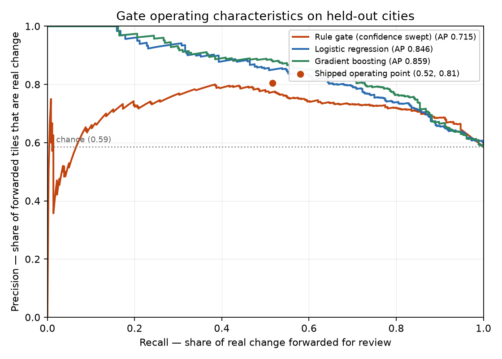

# Learned baselines vs the rule gate

Fitted on 1351 tiles from 14 train cities; evaluated on 621 tiles from 10 held-out cities. Positive prevalence on test: 0.586 (the precision a coin-flip classifier would reach).

All models see exactly the features the gate uses, on the same split.

| Model | Average precision | ROC AUC | Precision @ gate's recall |
|---|---|---|---|
| rule_gate_confidence | 0.715 | 0.719 | 0.775 |
| logistic_regression | 0.846 | 0.783 | 0.856 |
| gradient_boosting | 0.859 | 0.801 | 0.883 |

The shipped rule gate operates at recall 0.516, precision 0.805. The final column asks what each model achieves at that same recall, which is the like-for-like comparison.

Average precision is the summary statistic here rather than F1: it is threshold-free, so it compares the ranking each model produces instead of one arbitrarily chosen cut.
